# Development of SCADA systems

```mermaid
---
title: Development of SCADA systems
---
gantt
    dateFormat YYYY
    section Rockwell
        %%(https://www.plctalk.net/threads/factorytalk-rsview-product-history.127108/)
        Advisor PC : advisorpc, 1982, 2000
        ControlView : controlview, 1987, 1997
        RsView32    :1997, 2009
        RSView Enterprise : 2005, 2012
        Factory Talk View SE :2012, until 2025
        FactoryTalk Optix    : 2022, until 2025
    section Citect Technologies
        %%(https://en.wikipedia.org/wiki/Citect)
        CitectSCADA :c1, 1973, 2006
    section Invensys plc
        %%(https://en.wikipedia.org/wiki/Wonderware)
        Wonderware :s2, 1986, 2014
    section Metso automation
        %%(http://ains.etf.rs/Telvent.pdf)
        %%(No Start Date)
        Oasys :oasys, 1980, 2003
    section Telvent
        %%(https://www.reddit.com/r/SCADA/comments/1jwldin/development_of_scada_systems/)
        Oasys :oasys_telvent, after oasys, 2011
    section Serck Controls
        %(https://www.se.com/uk/en/about-us/company-profile/brands/serck-controls.jsp)
        SCX6 : scx6_serck, 1961, 2002
    section SCADAGroup
        %(https://www.se.com/uk/en/about-us/company-profile/brands/serck-controls.jsp)
        SCX6 : scx6, after scx6_serck, 2010
    section 7 technologies
        %%(No Start and End Dates)
        IGSS : igss, 2001, 2011
    section Schneider Electric
        CitectSCADA : se_citect, after c1, 2022
        Oasys :oasys_se, after oasys_telvent, 2022
        ClearSCADA :clearscada, after scx6, 2018
        %%(No Start and End Dates)
        IGSS : after igss, until 2025
    section AVEVA
        PlantSCADA : after se_citect, until 2025
        System Platform :after s2, until 2025
        %%(Don't have dates for Intouch)
        AVEVA Intouch HMI :after s2, until 2025
        %%(https://github.com/hutcheb/scada-timeline/issues/1)
        Geo SCADA Expert : after clearscada, until 2025
        AVEVA Enterprise : after oasys_se, until 2025
    section Honeywell
        %%(Estimates)
        PlantScape :plantscape, 1995, 2005
        Experion PKS: after plantscape, until 2025
    section Ipesoft
        %%(https://www.reddit.com/r/SCADA/comments/1jwldin/development_of_scada_systems/)
        %%(Modula2 5 years, Ada)
        Ipesoft D2000 :ipesoft, 1993, until 2025
    section ABB
        %%(https://de.wikipedia.org/wiki/800xA)
        Ability System 800xA : 2002, until 2025
    section Inductive Automation
        %%(https://en.wikipedia.org/wiki/Inductive_Automation)
        FactoryPMI : factorypmi, 2003, 2010
        Ignition :ignition, after factorypmi, until 2025
    section Iconics
        %%(https://en.wikipedia.org/wiki/Iconics)
        Genesis :genesis, 1986, 2011
    section Mitsubishi
        Genesis :after genesis, until 2025
    section UGS Corporation
        %%(https://drivesncontrols.com/siemens-ends-development-of-factorylink/)
        FactoryLink : factorylink, 1978, 2007
    section Open Systems International
        %%(https://en.wikipedia.org/wiki/Open_Systems_International)
        OSI Monarch : osi_monach, 1970, 2022
    section AspenTech
        %%(https://en.wikipedia.org/wiki/Aspen_Technology)
        AspenTech OSI Monarch : after osi_monach, until 2025
    section Siemens
        %%(https://www.renewableenergyworld.com/energy-business/siemens-power-transmission-and-distribution-merges-telegyr-systems-business/)
        %%(No Start Date)
        Telegyr : telegyr, 1990,2001
        %%(No End Date)
        Spectrum PowerCC : powercc, after telegyr, 2010
        %%(No Start and End Date)
        Spectrum PowerTG : after powercc, until 2025
        FactoryLink : after factorylink, 2009
        %%(https://en.wikipedia.org/wiki/WinCC)
        WinCC :siemens1, 1996, until 2025
        WinCC OA :winccoa, 2023, until 2025
    section Intellution
        %%(https://de.wikipedia.org/wiki/Proficy_iFIX)
        iFix : intellutionfix, 1984, 2002
    section GE
        iFix : after intellutionfix, until 2025
        %%(https://en.wikipedia.org/wiki/GE_Digital)
        Cimplicity :cimplicity, 1995, until 2025
    section Emerson
        %%(No idea)
        DeltaV : 1990, 30y
        %%(Estimate)
        Movicon Next : 2012, until 2025
        %%(No Start and End Dates)
        Ovation : 2020, until 2025
    section Yokogawa 
        %%(https://www.yokogawa.com/au/solutions/products-and-services/lifecycle-services/scada-as-a-service/)
        FAST/TOOLS : fasttools, 1978, 2021
        CI Server : after fasttools, until 2025
    section MyScada 
        %%(https://www.myscada.org/?gad_source=1&gclid=CjwKCAjw--K_BhB5EiwAuwYoyt0NUs6PUtTnmHe5BiQ-LWvguB-_bO55AFn8DI5Yvm9XYK23LpdgcBoCVIUQAvD_BwE)
        MySCADA : 2005, until 2025
    section Weatherford
        %%(https://www.weatherford.com/products-and-services/production-and-intervention/production-4-0/iot-scada-platform/)
        %%(No idea)
        Cygnet : 1990, 30y
    section Trihedral
        %%(https://en.wikipedia.org/wiki/Trihedral_Engineering)
        WEB : web, 1988, 1997
        Visual Tag System : vts, after web, 2007
        VTScada : after vts, until 2025
    section Elipse Software
        %%(https://www.elipse.com.br/en/empresa/) 
        Elipse E3  : 1986, until 2025
    section eLynx Technologies
        %%(https://www.elynxtech.com/company/about) 
        eLynx  : 2000, until 2025
    section Wizcon Systems 
        %%(https://www.wizconscada.com/)
        Wizcon  : 1980, 2008    
        %%(https://elutions-controlmaestro.com/ourcompany/)
        ControlMaestro : 2008, until 2025
    section Open Source
        %%(https://en.wikipedia.org/wiki/EPICS)
        EPICS : epics, 1994, until 2025
        %%(https://en.wikipedia.org/wiki/TANGO)
        TANGO : tango, 2001, until 2025
        %%(https://github.com/RapidScada/scada/graphs/code-frequency)
        RapidSCADA : rapidscada, 2014, until 2025
        %%(https://github.com/SCADA-LTS/Scada-LTS/graphs/code-frequency)
        SCADA-LTS : scada-lts, 2016, until 2025
        %%(https://github.com/pyscada/PyScada/graphs/code-frequency)
        PySCADA : pyscasa, 2013, until 2025
        %%(https://github.com/riclolsen/json-scada/graphs/code-frequency)
        json.scada : jsonscada, 2020, until 2025
        %%(https://github.com/frangoteam/FUXA/graphs/code-frequency)
        FUXA : fuxa, 2019, until 2025
        
```

## Status
I have provided references for most of them, some of the Yokogawa and Emerson stuff I wasn't able to find any information on.
The wiki references were easy, ideally there would be proper references from each company.

## Contribution
Please feel free to raise a PR or Issue to get it updated. Always looking for help.